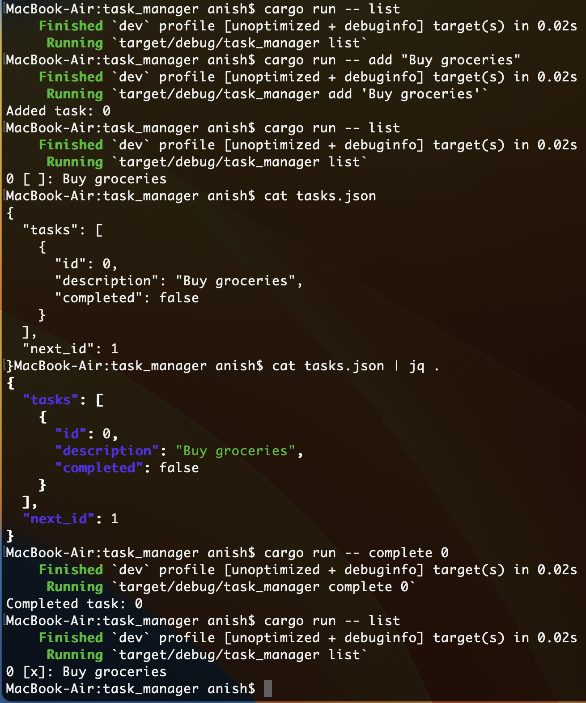

### Rust Compiler

- rustup update
- rustc --version

### How to Run:

- Run cargo run -- add "Buy groceries" to add a task.
- Use commands like cargo run -- list, cargo run -- complete 0, or cargo run -- delete 0.
- Run cargo test to execute tests.

### Key Features:

- Tasks are stored in tasks.json and persist between runs.
- Supports adding, listing, completing, and deleting tasks.
- Uses clap for intuitive CLI parsing and serde for JSON handling.

### Extensibility Added:

- SQLite Database: Tasks are now stored in a SQLite database (tasks.db), allowing for more robust querying and scalability. The schema includes id, description, and completed fields.

- Benefits: SQLite supports concurrent access, complex queries (e.g., filtering by status), and is lightweight compared to JSON file I/O.

### Unit Tests:

- Tests use an in-memory SQLite database for isolation.
- Cover adding a task, completing a task, deleting a task, and listing tasks (empty case).
- Verify database state after operations (e.g., task exists, completed status, row count).

